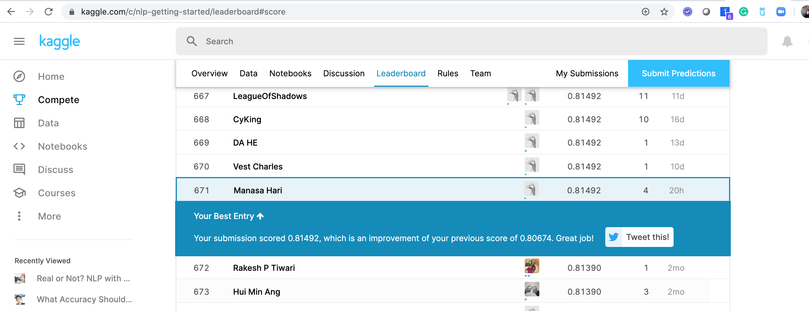

# Disaster-Classification
Twitter has been the most important part of digital communication these days. It has been the channel
of communication across the world for daily news starting from television gossips to case-of-emergency news. But
due to large amounts of data flooding into the twitter base every minute, sometimes, a highly important piece of
news such as a disaster occurrence can be submerged amidst not at all important tweets. Due to this, it may take
days or even weeks before the disaster news reaches to people, meanwhile, a huge irrevocable loss can happen
already. This project aims to highlight the disaster emergency news so that users can be constantly notified on the
emergency issues out of millions of other tweets. We take the challenge to build a machine learning model that
classifies between tweets about real disasters and the rest. The key challenge is to distinguish metaphorical
usage of tragedy vocabulary and the real intended usage of disaster terms. For example, a user tweets ‘Thoughts
are a storm, unexpected’. This is clearly a metaphorical statement. Even though it is obvious for humans to
interpret that this tweet is not about a real disaster, but it is less clear to a machine. This problem is also an
actively ongoing Kaggle competition. We want to explore possible predictors and conclude on the right predictors
to solve this classification problem. The dataset has 10,000 tweets that were hand classified[1]. We will explore
Naïve Bayes, LSTM and CNN classifiers to solve this problem.

 
 

<b>Below is the kaggle score we achieved </b>
 </img>

 
 
 
 

<b>Training Log Loss with iterations </b> 
 </img>

 
 
 
 
<b>Kaggle Score vs Optimization iterations </b> 
 </img>
 </img>
 
 

 
 

<b>Test Scores vs Batch Size </b> 
 </img>
 </img>

